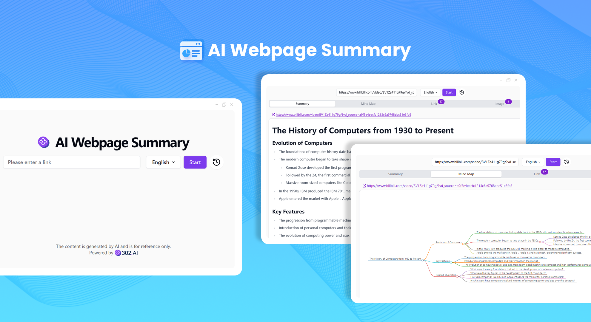
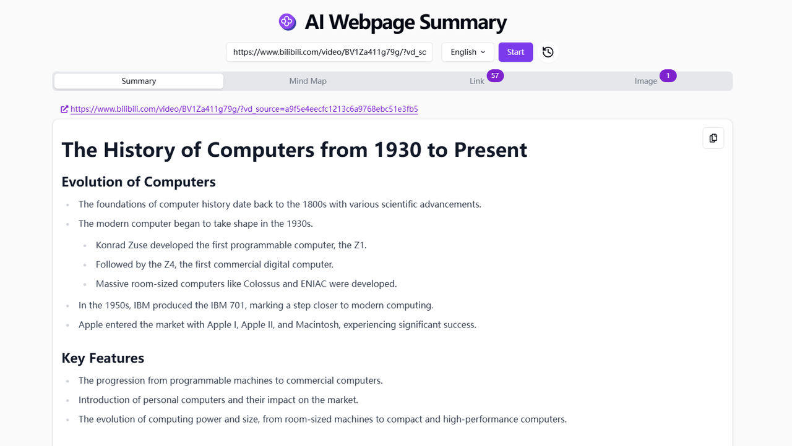
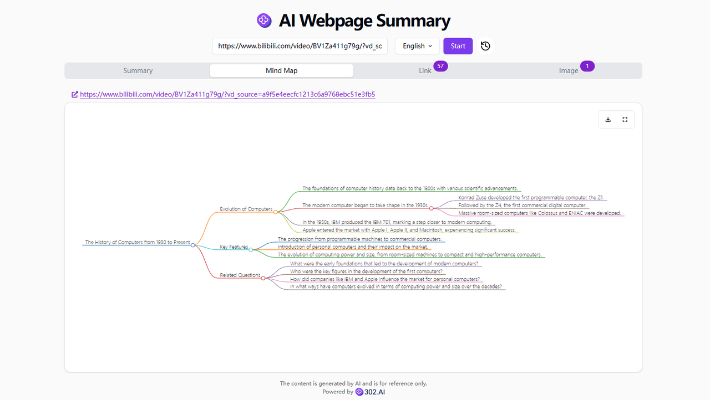

# 
📝 AI Webpage Summary 🚀✨

The AI web page summary supports obtaining content from a link through the Jina Reader, and using a large language model to summarize it. Meanwhile, it can generate an easy-to-understand mind map and extract the links and pictures in it.

<a href="README_zh.md">中文</a> | <a href="README.md">English</a> | <a href="README_ja.md">日本語</a>

 

Open-source version of the [AI Webpage Summary](https://302.ai/tools/websum/) from [302.AI](https://302.ai).
You can directly log in to 302.AI for a zero-code, zero-configuration online experience.
Alternatively, customize this project to suit your needs, integrate 302.AI's API KEY, and deploy it yourself.

## Interface Preview
You can generate a web page summary by simply inputting the link.
     

Generate a mind map for the web page.

## Project Features
### 📝 Web Page Summary
Summarize web pages comprehensively and quickly extract the key points of web pages.
### 🧠 Mind Map
Visually summarize web pages and quickly generate mind maps.
### 🔗 Links
Quickly extract the hyperlinks existing in web pages.
### 🖼️ Pictures
List all the pictures that have appeared on the web pages, and support zooming in for viewing.
### 🌓 Dark Mode
Support dark mode to protect your eyes.
### 🌍 Multi-language Support
- Chinese Interface
- English Interface
- Japanese Interface

## 🚩 Future Update Plans 
- [ ] Verification and expansion of link validity
- [ ] Add image analysis and annotation functions. For example, automatically identify the theme of the image, the main object, the approximate emotional atmosphere, etc., and be able to add corresponding text annotations to the image, so that users can better understand the connection and role of the image with the overall content of the web page when viewing the summary

## Tech Stack
- Next.js 14
- Tailwind CSS
- Shadcn UI
- Dexie.js

## Development & Deployment
1. Clone the project: `git clone https://github.com/302ai/302_webpage_summary`
2. Install dependencies: `pnpm install`
3. Configure the 302 API KEY (refer to .env.example)
4. Run the project: `pnpm dev`
5. Package and deploy: `docker build -t websum . && docker run -p 3000:3000 websum`

## ✨ About 302.AI ✨
[302.AI](https://302.ai) is a pay-as-you-go AI application platform, bridging the gap between AI capabilities and practical implementation.
1. 🧠 Comprehensive AI capabilities: Incorporates the latest in language, image, audio, and video models from leading AI brands.
2. 🚀 Advanced application development: We build genuine AI products, not just simple chatbots.
3. 💰 No monthly fees: All features are pay-per-use, fully accessible, ensuring low entry barriers with high potential.
4. 🛠 Powerful admin dashboard: Designed for teams and SMEs - managed by one, used by many.
5. 🔗 API access for all AI features: All tools are open-source and customizable (in progress).
6. 💡 Powerful development team: Launching 2-3 new applications weekly with daily product updates. Interested developers are welcome to contact us.
