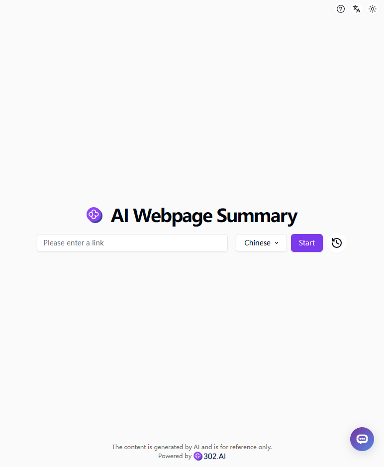
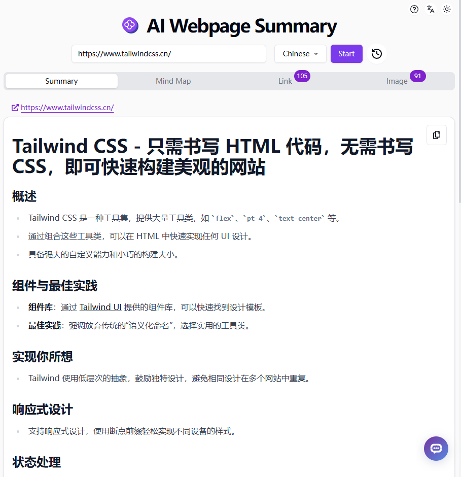
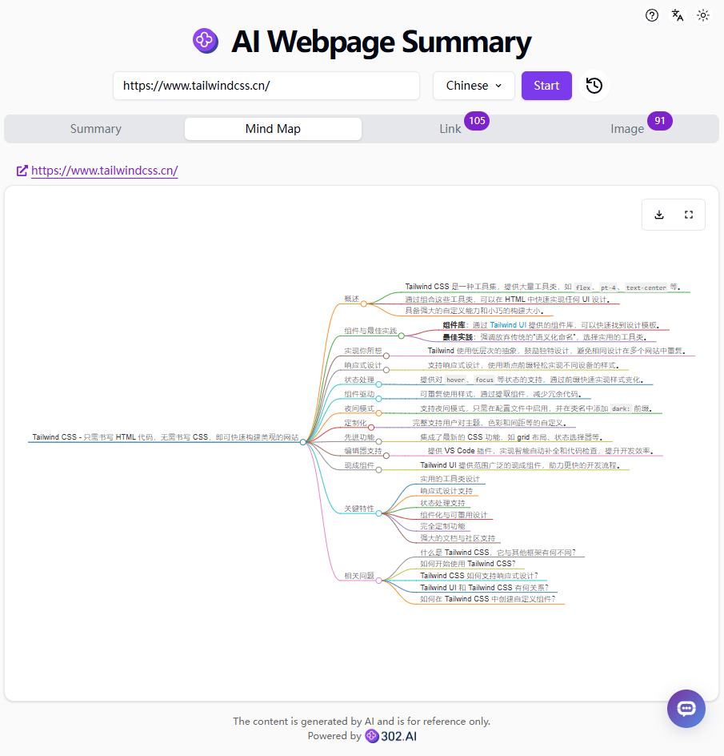

# 🤖 Welcome to 302.AI's AI Webpage Summary! 🚀✨

[Chinese](README_zh.md) | [English](README.md) | [Japanese](README_ja.md)

The open-source version of [AI Webpage Summary](https://302.ai/tools/websum/) from [302.AI](https://302.ai).
You can directly log in to 302.AI and use the online version with zero code and zero configuration.
Or modify this project according to your needs, input the 302.AI API KEY, and deploy it yourself.

## ✨ 302.AI Introduction ✨
[302.AI](https://302.ai) is a pay-as-you-go AI application platform.
- 🧠 Aggregates the latest AI capabilities and brands.
- 🚀 Develops real AI products based on foundational models.
- 💰 Zero monthly fees, all functions pay-as-you-go.
- 🛠 Powerful management backend for teams and SMEs.
- 🔗 Provides API access for all AI capabilities.
- 💡 Strong development team with daily updates.

## Project Features
- 📝 Webpage summary for quick understanding.
- 🧠 Mind map for visual summary.
- 🔗 Quick link extraction.
- 🖼️ Image listing with zoom-in support.
- 🌓 Dark mode for eye protection.
- 🌐 Internationalization supporting Chinese, English, and Japanese.

## Technology Stack
- Next.js 14
- Tailwind CSS
- Shadcn UI
- Dexie.js

## Development & Deployment
1. Clone the project: `git clone https://github.com/302ai/302_webpage_summary`
2. Install dependencies: `pnpm install`
3. Configure the 302 API KEY (refer to .env.example)
4. Run the project: `pnpm dev`
5. Package and deploy: `docker build -t websum . && docker run -p 3000:3000 websum`

## Interface Preview

