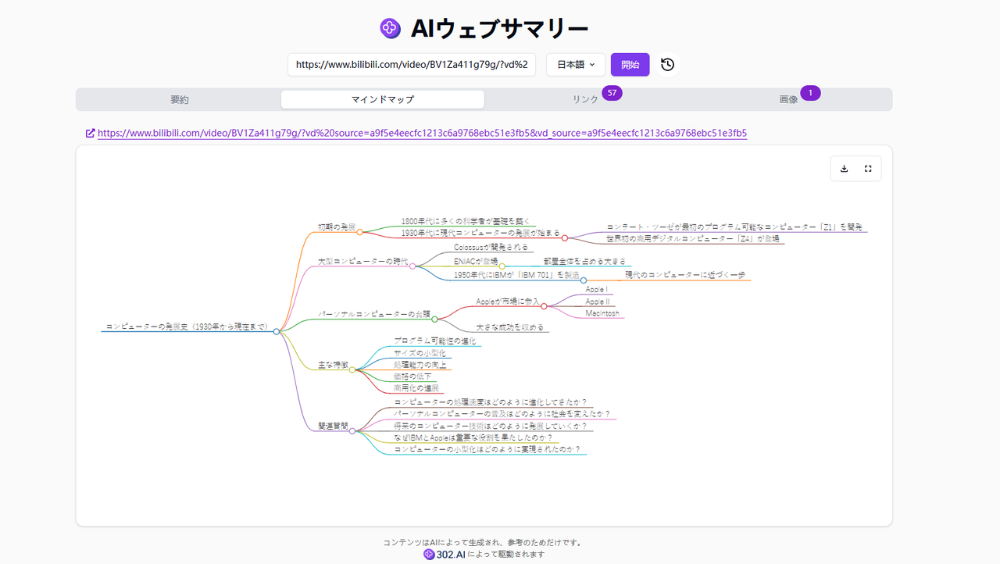

# 
📝 AIホームページのまとめ 🚀✨

AI によるウェブページの要約機能は、Jina Reader を通じてリンクからコンテンツを取得し、大規模言語モデルを使ってそれを要約することをサポートしています。同時に、分かりやすいマインドマップを生成し、その中のリンクと画像を抽出することもできます。

<a href="README zh.md">中文</a> | <a href="README.md">English</a> | <a href="README_ja.md">日本語</a>

[302.AI](https://302.ai)の[AIウェブページサマリー](https://302.ai/tools/websum/)のオープンソース版です。
302.AIに直接ログインすることで、コード不要、設定不要のオンライン体験が可能です。
あるいは、このプロジェクトをニーズに合わせてカスタマイズし、302.AIのAPI KEYを統合して、自身でデプロイすることもできます。

## インターフェースプレビュー
リンクを入力するだけでウェブページの要約を生成できます。
      

ウェブページのマインドマップを生成する。

## プロジェクトの特徴
### 📝 ウェブページの要約
ウェブページを包括的に要約し、ウェブページの要点を迅速に抽出する。
### 🧠 マインドマップ
ウェブページを視覚的に要約し、迅速にマインドマップを生成する。
### 🔗 リンク
ウェブページに存在するハイパーリンクを迅速に抽出する。
### 🖼️ 画像
ウェブページに登場したすべての画像を一覧表示し、拡大表示をサポートする。
### 🌓 ダークモード
ダークモードをサポートし、あなたの目を保護する。
### 🌍 多言語サポート
- 中国語インターフェース
- 英語インターフェース
- 日本語インターフェース

## 🚩 将来のアップデート計画
- [ ] リンクの有効性の検証と拡張
- [ ] 画像分析と注釈付け機能を追加する。例えば、画像のテーマ、主要な対象、および大まかな感情的な雰囲気などを自動的に識別し、画像に対応するテキスト注釈を追加することができる。これにより、ユーザーは要約を閲覧する際に、画像とウェブページの全体的な内容との関連性と役割をよりよく理解することができる

## 技術スタック
- Next.js 14
- Tailwind CSS
- Shadcn UI
- Dexie.js

## 開発&デプロイ
1. プロジェクトをクローン：`git clone https://github.com/302ai/302_webpage_summary`
2. 依存関係をインストール：`pnpm install`
3. 302のAPI KEYを設定（.env.exampleを参照）
4. プロジェクトを実行：`pnpm dev`
5. パッケージング&デプロイ：`docker build -t websum . && docker run -p 3000:3000 websum`

## ✨ 302.AIについて ✨
[302.AI](https://302.ai)は、AIの能力と実用的な実装の間のギャップを埋める、従量制のAIアプリケーションプラットフォームです。
1. 🧠 包括的なAI機能：主要AIブランドの最新の言語、画像、音声、ビデオモデルを統合。
2. 🚀 高度なアプリケーション開発：単なるシンプルなチャットボットではなく、本格的なAI製品を構築。
3. 💰 月額料金なし：すべての機能が従量制で、完全にアクセス可能。低い参入障壁と高い可能性を確保。
4. 🛠 強力な管理ダッシュボード：チームやSME向けに設計 - 一人で管理し、多くの人が使用可能。
5. 🔗 すべてのAI機能へのAPIアクセス：すべてのツールはオープンソースでカスタマイズ可能（進行中）。
6. 💪 強力な開発チーム：大規模で高度なスキルを持つ開発者集団。毎週2-3の新しいアプリケーションをリリースし、毎日製品更新を行っています。才能ある開発者の参加を歓迎します。
