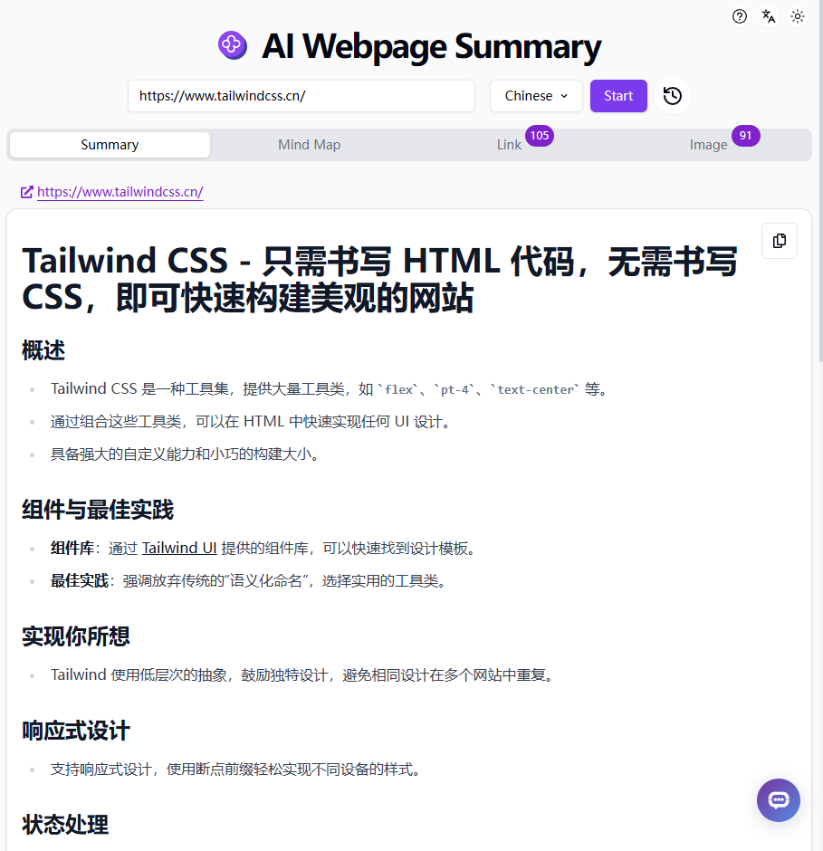

# 🤖 302.AIのAIウェブページサマリーへようこそ! 🚀✨

[中文](README_zh.md) | [English](README.md) | [日本語](README_ja.md)

[302.AI](https://302.ai)の[AIウェブページサマリー](https://302.ai/tools/websum/)のオープンソース版です。
302.AIに直接ログインすることで、コード不要、設定不要のオンライン体験が可能です。
あるいは、このプロジェクトをニーズに合わせてカスタマイズし、302.AIのAPI KEYを統合して、自身でデプロイすることもできます。

## ✨ 302.AIについて ✨
[302.AI](https://302.ai)は、AIの能力と実用的な実装の間のギャップを埋める、従量制のAIアプリケーションプラットフォームです。
1. 🧠 包括的なAI機能：主要AIブランドの最新の言語、画像、音声、ビデオモデルを統合。
2. 🚀 高度なアプリケーション開発：単なるシンプルなチャットボットではなく、本格的なAI製品を構築。
3. 💰 月額料金なし：すべての機能が従量制で、完全にアクセス可能。低い参入障壁と高い可能性を確保。
4. 🛠 強力な管理ダッシュボード：チームやSME向けに設計 - 一人で管理し、多くの人が使用可能。
5. 🔗 すべてのAI機能へのAPIアクセス：すべてのツールはオープンソースでカスタマイズ可能（進行中）。
6. 💪 強力な開発チーム：大規模で高度なスキルを持つ開発者集団。毎週2-3の新しいアプリケーションをリリースし、毎日製品更新を行っています。才能ある開発者の参加を歓迎します。

## プロジェクトの特徴
1. 📝 ウェブページのサマリー：包括的なサマリーを行い、ウェブページの要点を迅速に理解します。
2. 🧠 マインドマップ：ウェブページを視覚化してサマライズし、迅速にマインドマップを生成します。
3. 🔗 リンク：ウェブページ内のハイパーリンクを迅速に抽出します。
4. 🖼️ 画像：ウェブページに表示されたすべての画像を一覧表示し、ズームインして表示します。
4. 🌓 ダークモード：ダークモードをサポートし、目を保護します。
5. 🌐 国際化：複数言語をサポートし、現在は中国語、英語、日本語をサポートしています。

## 技術スタック
- Next.js 14
- Tailwind CSS
- Shadcn UI
- Dexie.js

## 開発&デプロイ
1. プロジェクトをクローン：`git clone https://github.com/302ai/302_webpage_summary`
2. 依存関係をインストール：`pnpm install`
3. 302のAPI KEYを設定（.env.exampleを参照）
4. プロジェクトを実行：`pnpm dev`
5. パッケージング&デプロイ：`docker build -t websum . && docker run -p 3000:3000 websum`

## インターフェースプレビュー

